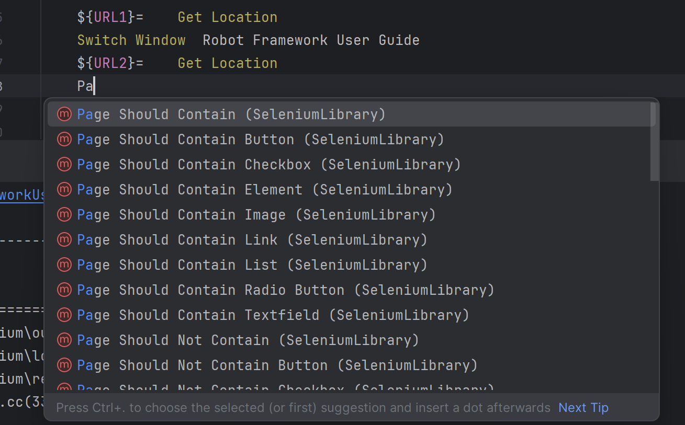

# Robot Framework with Selenium

---

Robot framework is a generic test automation framework for acceptance testing.

It has easy-to-use tabular syntax utilizing keyword driven testing approach.

Libraries are implemented either in Java or Python.

### Advantages of Robot framework

---
1. Free
2. Simple tabular syntax
3. Fast automation with minimal code efforts
4. Detailed logs
5. Generic libraries and customization allowed with user defined libraries
6. Supports Web, Swing, Windows GUI, SSH, Telnet, Databases etc

### Libraries

---

####  Built-in
Robot framework come with few libraries bundled like telnet etc

#### External
We have a wide range of external libraries to work with. Please check below link

    https://robotframework.org/?tab=builtin#resources

## Installation

---
We can use pip to install Robotframework

pip install robotframework

Similarly, we can install any library for robot framework 

pip install --upgrade robotframework-seleniumlibrary

### Project structure

---
All Robot testcases are stored in the file with extension .robot

#### Main blocks of Robot testcase file

---
*** Settings ***

Settings section has the configuration of our testcase

*** Variables ***

User defined variables of the testcase
There should be only 2 spaces between variable name and value.

Example:``` ${Browser}  Chrome```

*** Test Cases ***\
Main testcases section\
There should be exact 2 spaces between keyword and arguments, and between argument and argument.\
Example ```Open Browser  \${Browser}  ${URL}```

*** Keywords ***\
To write any user defined keywords

## Element Locator

Locators are used to locate any element uniquely on a web page.

CSS Selectors:

By ID
```
css=#email       //Without using any html tag
css=input#email  //With html tag
```

By Class
```
css=input.inputtext
```
By any other attribute
```
css=tag[attributeName='Value']
```
Tag can be optional or * to denote any tag

By Combination
```
css=tag#id[attribute='Value']
css=tag.class[attribute='Value']
```

XPath Selectors:

By attribute
```
//tag[@attribute='Value']    // Single attribute
//tag[@attribute1='Value1' or @attribute2='Value2'] //Multiple attributes with OR
//tag[@attribute1='Value1' and @attribute2='Value2'] //Multiple attributes with AND
//*[@attribute='Value'] //Any tag with given attribute
//tag[@*='Value'] //Tag with any attribute with value
//tag[contains(@attribute,'Value')]
```

Using text
```
//tag[text()='Value']
//tag[contains(text(), 'Value')]
```
Using xpath axes to locate using hierarchy i.e. parent, grandparent, children etc

## Keywords

Reference - https://robotframework.org/SeleniumLibrary/SeleniumLibrary.html

Generic syntax for any Robot statement is

\<Keyword>  \<arg1>     \<arg2>

There should be 2 spaces between keyword and arg, arg and arg.
Most of the keywords are more than 1 word. Below are the most commonly used keywords in Selenium library.

Locator syntax is slightly different from what we usually use.\
It is like \<attribute>:\<value>

Example:

Input Text  id:engineperformance  1.5BHP

```
    Open Browser  ${URL}  ${Browser}
    Input Text  <locator>  <value>
    Click Link  <locator>
    Maximize Browser Window
    Clear Element Text  <locator>
    Select Radio Button  <group>  <value>
    Select Checkbox  <locator>
    Click Button  <locator>
    Select From List By Index  <locator>  <index value>   //It is zero indexed
    Select From List By Value  <locator>  <value>
    Select From List By Label  <locator>  <visibla label>
    Set Selenium Speed  <time>  //Adds waits after each step. Example 2seconds
    
```

## User defined keywords

We can define keywords for making steps reusable (similar to methods). Below is one example of keywords defined with arguments.

```
*** Settings ***
Library  SeleniumLibrary

*** Variables ***
${Browser}  Chrome
${URL}  https://thetestingworld.com/testings/

*** Test Cases ***
TC_OO1_BROWSER_START_AND_CLOSE
    Open Browser  ${URL}  ${Browser}
    Maximize Browser Window
    Set Selenium Speed  1 second
    Enter Details  testing  testing@xyz.com  abc123xyz
    #Click Link  id:nav_camper
    #Input Text  id:engineperformance  1.5BHP
    #Select Radio Button  Right Hand Drive  No
    #Click Element  xpath://label[normalize-space()='No']
    Close Browser

*** Keywords ***
Enter Details
    [Arguments]  ${userName}  ${email}  ${password}
    Input Text  name:fld_username  ${userName}
    Input Text  name:fld_email  ${email}
    Input Text  name:fld_password  ${password}
```
### Define and print variables:

**set variable** keyword is used to set the variable inside testcase section
**log to console** keyword is used to print the variable

```
${var}=     set variable  Hello world  //tab after = and 2 spaces after keyword
log to console  ${var}                  // 2 spaces after keyword
```

### Define and use a list:

List is part of standard library **Collection**

```
    ${var}=     set variable  Hello World
    ${list}=    create list     Hello   world   22  23.23
    ${listLength}   get length  ${list}
    ${listData}=    get from list  ${list}  1       //List is zero indexed
    log to console  ${var}
    log to console  ${listLength}
    log to console  ${listData}
```

### For loop:

```
    FOR   ${i}    IN RANGE    1   10
    log to console  ${i}
    END
```

Iterating through a list

```
    ${list}=    create list     Hello   world   22  23.23
    FOR     ${i}  IN  @{list}
    log to console  ${i}
    END
```

### RUN Keyword conditionally:

We can store the keywords in the variable and run them using **run keyword** keyword

```
    ${key_word}=  set variable  log to console
    run keyword  ${key_word}  Hello Rasool
```

We can also conditionally run a keyword by passing a condition for keyword **run keyword if**

```
    ${key_word}=  set variable  log to console
    run keyword  ${key_word}  Hello Rasool
    ${condition}=  set variable  YES
    run keyword if  '${condition}'=='YES'  log to console  It is yes
```

### Set and Get selenium speed:

Selenium speed is used to set the wait time between each selenium step following this instruction

```
    Open Browser  ${URL}  ${Browser}
    Maximize Browser Window
    Set Selenium Speed  1 second                        //Waits for 1 second after selenium step following this
    Click Link  id:nav_camper
    Input Text  id:engineperformance  1.5BHP
    Select Radio Button  Right Hand Drive  No
    Click Element  xpath://label[normalize-space()='No']
    Close Browser
```

Set Selenium Speed - to set the selenium speed
Get Selenium Speed - TO get the set selenium speed

Sleep keyword is used to wait in only one step

```
    Open Browser  ${URL}  ${Browser}
    Maximize Browser Window
    sleep  1 second                        //Waits for 1 second after only this step and continues exceution normally
    Click Link  id:nav_camper
    Input Text  id:engineperformance  1.5BHP
    Select Radio Button  Right Hand Drive  No
    Click Element  xpath://label[normalize-space()='No']
    Close Browser
```

### Set/Get Selenium timeout:

We can set explicit timeout for element visibility. Default is 5 seconds

```
set selenium timeout  5 seconds
get selenium timeout
```

### Implicit wait:

```
set selenium implicitly wait
```

### Take screenshot:

```
Capture Page Screenshot  <screenshot path> //To capture full page screenshot and save it in the provided path. Path can be absolute or relative to Project dir
Capture Element Screenshot  <locator>  <Screenshot path> //To capture screenshot of particular element
```

Note: ***The screenshot is captured only till the part visible on screen***

```
Close All Browsers - Closes all the browsers opened by Robot framework script
```

### Browser related keywords:

Go To - To open a different URL\
Go Back - To navigate back i.e. click Back button on the browser\
Get Location - To get the URL that is currently open

```
*** Variables ***
${Browser}  Chrome
${URL}  https://thetestingworld.com/testings/

*** Test Cases ***
TC_OO1_BROWSER_START_AND_CLOSE
    Open Browser  ${URL}  ${Browser}
    Go To  https://www.google.com
    ${URL1}=    Get Location            // Gets Currently open URL
    Go Back                             //Navigates back to original URL
```

### Execute Javascript at runtime:

***Execute Javascript*** keyword is used to perform javascript actions on browser. Below is an example to scroll the browser window using javascript

```
    Execute Javascript  window.scrollTo(0,1000)     // Scroll values in pixels
```

### Mouse actions:

Open Context Menu - Open context menu i.e. right click but takes locator as argument to right-click on\
Double Click Element - Double-clicks on the element by taking element locator as argument\
Mouse Down - Clicks mouse down button on the element locator argument provided\
Mouse Up - Clicks mouse up button on the element locator argument provided\
Mouse Over - Hovers the mouse pointer on the element with provided argument locator\

```
    Open Context Menu    xpath://span[contains(text(),'VIDEOS')]
    Double Click Element    xpath://a[text(),'Login']
    Mouse Down    xpath://a[text(),'Login']
    Mouse Up    xpath://a[text(),'Login']
    Mouse Over    xpath://a[text(),'Login']
```

### Keyboard operations:

Used to enter non-alpha numeric keys
***Press Key*** is used to enter keys

For Alpha numeric characters, we can directly use them. But for non text characters, we need to use ASCII value
When using ascii value, we need to give \\ before the value

```
    Press Key    xpath://input    hello
    Press Key    xpath://button    \\13
```

### Wait commands:

Wait commands can be used to wait till some condition is met. Some basic ones are

Wait Until Page Contains -              Waits until some text is displayed on the browser\
Wait Until Page Contains Element -      Waits until some element is loaded on the browser\
Wait Until Element Contains -           Waits until the given element contains some text\
Wait Until Element Visible -            Waits until given element is visible\
Wait Until Element Enable -             Waits until given element is enabled

Default timeout for these waits is 5 seconds. We can override this by using ***Set Selenium Timeout*** keyword

### Multi window handling:

***Switch Browser*** keyword is used to switch between browsers and perform actions.

We can switch between browsers using the index of the browser i.e. the order in which they are opened or using alias which was given to the browser when opening the browser.

Here the index starts from 1.

Note: ***It is not visually shown switching between windows on screen, but it happens***

```
    Open Browser  ${URL}  ${Browser}
    Maximize Browser Window
    Open Browser  https://www.google.com  ${Browser}  alias=google  //Browser started with alias
    Maximize Browser Window
    Switch Browser    1                                             // Index of the browser started 1st
    ${var_url_1}=   Get Location
    Log To Console    ${var_url_1}                                  // Prints first URL
    Switch Browser    google                                        // Switches using alias
    ${var_url_1}=   Get Location
    Log To Console    ${var_url_1}                                  // Prints https://www.google.com
```

***Switch Window*** keyword is used for switching between tabs using either page title or URL

```
    Open Browser  ${URL}  ${Browser}
    Maximize Browser Window
    Click Element  //a[normalize-space()='creating test libraries']
    Switch Window  Robot Framework
    ${URL1}=    Get Location
    Switch Window  Robot Framework User Guide
    ${URL2}=    Get Location
    Log To Console    ${URL1}
    Log To Console    ${URL2}
```

Everytime, title might not be present or URL might be dynamic. In those scenarios, we use Window Handler to switch between tabs.

## Validations

---

We can put validations on the page using multiple keywords available in Robot Framework

### Page Should Contain & Page Should Not Contain:

Do an assertion by checking if a certain text is present or not present based on context.

This assertion is usually used to assert the page proper load.

### Page Should Contain \<Element> & Page Should Not Contain \<Element>:

This is also similar to above assertion but instead of text, we validate an element



### Checkbox validations:

We can get the checkbox if checked or not by using below keywords

Checkbox Should Be Selected  \<locator>
Checkbox Should Not Be Selected  \<locator>

### Element text validations:

Below keywords can be used to validate the text for a given element

```
    element text should be  <locator>  <exact text>
    element text should not be  <locator>  <exact text>
    element should contain  <locator>  <exact text>
    element should not contain  <locator>  <exact text>
    
```

### Few more validations:

To validate title

``` Title should be <expected title>```

To check if element is visible

``` 
Element should be visible  <locator> 
Element should not be visible  <locator> 
```

To check if element is enabled

``` 
ELement should be enabled  <locator>
ELement should be disabled  <locator> 
```

## Creating resource files

---

Resource files are where we keep reusable data (keywords, variables etc..)

### User defined keywords:

UtilResources.robot

```
    *** Settings ***
    Library  SeleniumLibrary

    *** Variables ***
    ${Browser}  Chrome
    ${URL}  https://thetestingworld.com/testings/

    *** Keywords ***
    Start Browser and Maximize
        Open Browser  ${URL}  ${Browser}
        Maximize Browser Window
```

Testcase.robot

```
*** Settings ***
Library  SeleniumLibrary
Resource  ../resources/UtilsResources.robot     // Created resouce file is imported here

*** Variables ***

*** Test Cases ***
TC_005_resources
    Start Browser and Maximize
    Input Text  name:fld_username  Hello world

```

### User defined keywords with arguments:

Resource.robot

```
*** Settings ***
Library  SeleniumLibrary

*** Variables ***
${Browser}  Chrome
${URL}  https://thetestingworld.com/testings/

*** Keywords ***
Start Browser and Maximize
    Open Browser  ${URL}  ${Browser}
    Maximize Browser Window

Enter Details
    [Arguments]  ${userName}  ${email}  ${password}
    Input Text  name:fld_username  ${userName}
    Input Text  name:fld_email  ${email}
    Input Text  name:fld_password  ${password}
```

Testcase.robot:

```
*** Settings ***
Resource  ../resources/UtilsResources.robot

*** Variables ***

*** Test Cases ***
TC_005_resources
    Start Browser and Maximize
    Enter Details  testing  testing@xyz.com  abc123xyz

```

### Return value from user defined keyword:

To return a value from the keyword, we need to use [Return] (in the square brackets)

Resource.robot

```
*** Settings ***
Library  SeleniumLibrary

*** Variables ***
${Browser}  Chrome
${URL}  https://thetestingworld.com/testings/

*** Keywords ***
Start Browser and Maximize
    Open Browser  ${URL}  ${Browser}
    Maximize Browser Window
    ${title}=   Get Title
    Log To Console    ${title}
    [Return]  ${title}

Enter Details
    [Arguments]  ${userName}  ${email}  ${password}
    Input Text  name:fld_username  ${userName}
    Input Text  name:fld_email  ${email}
    Input Text  name:fld_password  ${password}
```

Testcase.robot:

```
*** Settings ***
Resource  ../resources/UtilsResources.robot

*** Variables ***

*** Test Cases ***
TC_005_resources
    ${Res}=  Start Browser and Maximize
    Log To Console    ${Res}
    Enter Details  testing  testing@xyz.com  abc123xyz

```

## Adding details to testcase

---

### Adding documentation:

We can use [Documentation] keyword to write more info about testcase or keyword

We can add Documentation to the robot file with keyword Documentation (without square brackets)

```
*** Settings ***
Resource  ../resources/UtilsResources.robot
Documentation  This is learning suite
*** Variables ***

*** Test Cases ***
TC_005_resources
    [Documentation]  Testing the user defined keywords
    ${Res}=  Start Browser and Maximize
    Log To Console    ${Res}
    Enter Details  testing  testing@xyz.com  abc123xyz

```

### Timeout:

Used to define timeout for the testcase. Keyword [Timeout] is used\
If the testcase is not finished within the timeout provided, it will be failed with reason timeout exceeded

```
*** Settings ***
Resource  ../resources/UtilsResources.robot
Documentation  This is learning suite
*** Variables ***

*** Test Cases ***
TC_005_resources
    [Documentation]  Testing the user defined keywords
    [Timeout]  2mins 8s  Failed to execute on time          // Second argument is message to be shown if timeout occurred
    ${Res}=  Start Browser and Maximize
    Log To Console    ${Res}
    Enter Details  testing  testing@xyz.com  abc123xyz

```

Timeout can be defined at keyword level also in the same way as above

We can add timeout globally for testcases in the settings level

```test timeout 10s```

### Setup & Teardown:

We can have setup and teardown at testcase and testsuite level

We can use keywords [Setup] and [Teardown] to call the user defined/inbuilt keywords as setup and teardown at testcase level. Below is the example.

Resource.robot

```
*** Settings ***
Library  SeleniumLibrary

*** Variables ***
${Browser}  Chrome
${URL}  https://thetestingworld.com/testings/

*** Keywords ***
Start Browser and Maximize
    [Documentation]  This keyword opens and maximizes the browser
    Open Browser  ${URL}  ${Browser}
    Maximize Browser Window

Close Browser Window
    ${title}=   Get Title
    Log To Console    ${title}
    Close Browser

Enter Details
    [Arguments]  ${userName}  ${email}  ${password}
    Input Text  name:fld_username  ${userName}
    Input Text  name:fld_email  ${email}
    Input Text  name:fld_password  ${password}
```

Testcase.robot

```
*** Settings ***
Resource  ../resources/UtilsResources.robot
Documentation  This is learning suite
*** Variables ***

*** Test Cases ***
TC_005_resources
    [Documentation]  Testing the user defined keywords
    [Setup]  Start Browser and Maximize                     //Keyword defined in resource file
    [Teardown]  Close Browser Window                        //Keyword defined in resource file
    Enter Details  testing  testing@xyz.com  abc123xyz
```

The Setup and Teardown defined in the testcase is applicable only for the testcase only

To define setup and teardown at a file or suite level, please check below example

```
*** Settings ***
Resource  ../resources/UtilsResources.robot
Documentation  This is learning suite
Test Setup  Start Browser and Maximize  //Runs before each testcase
Test Teardown  Close Browser Window     // Runs after each testcase
*** Variables ***

*** Test Cases ***
TC_005_resources
    [Documentation]  Testing the user defined keywords
    Enter Details  testing  testing@xyz.com  abc123xyz
```

## Test suites

---

Each Robot file/folder/sub-folder can behave as testsuite

Consider below folder structure
<pre>
One
    ├───Three
    │       TC_006_Setup_Teardown_Testcase.robot
    │       TC_007_Setup_Teardown_TestcaseGlobal.robot
    │
    └───Two
            TC_005_Resources.robot
</pre>
Here folder One has 2 subfolders Two and Three. Inturn each subfolder has one or more robot files with testcases

We can run tests at multiple levels here. We can run single robot file using below command

robot TC_005_Resources.robot

We can run all robot files in a given folder

robot Three  //Runs 2 robot files

We can run the folder which has subfolders also

robot One       //Runs all 3 robot files

## Before and After suite

---

We can use ***Suite Setup*** and ***Suite Teardown*** to define the keywords to run at a file level

To define setup, teardown, variables at a folder level, we need to define them in a __init__.robot file

## Tags & Control execution using tags

---

Tags can be used to group the related testsuites files

We can add tags at testcase level using [Tags] keyword.

```
*** Settings ***
Resource  ../../../resources/UtilsResources.robot
Documentation  This is learning suite

*** Variables ***

*** Test Cases ***
TC_005_resources
    [Documentation]  Testing the user defined keywords
    [Tags]  smoke
    ${Res}=  Start Browser and Maximize
    Log To Console    ${Res}
    Enter Details  testing  testing@xyz.com  abc123xyz

Selecting checkbox
    [Tags]  smoke  sanity
    Select Radio Button    add_type    office

```

We can run testcases of a specific tag using below command

```robot -i <tag> <file>```

When it is run at a folder level, the test cases across files with given tag only will be applied

### Default and Forced Tags:

Default Tags can be defined to be applied to all test case in a suitefile where the tag is not explicitly defined. We need to define it in Settings area with below keyword

```default tags  <tag1> ....```

Forced tags are also defined in the same way as default tags but the difference is this tag is applied to all testcases irrespective of it having a tag or not

```force tags  <tag1> ....```

Different options in robot run command are

We can use logical operators OR, AND, NOT to combine tags

robot -i \<tag1>AND\<tag2>  - Runs all testcases where the tags tag1 and tag2 are given

Similar behavior for other operators also

-i   - TO include specified tags\
-e   - To exclude specified tags\
-t   - Execute single testcase

robot -t "testcase name" suitefile/folder

-s  - Execute particular suite

robot -s "Suite name"  suitefolder

## Specify logs locations

---

-r - To specify report file path\
-o - To specify output file path\
-l - To specify log file

robot -o output/output.xml -r reports/report.html -l logs/log.html suite

## Fetch values at runtime

Both built in and external libraries like Selenium provide keywords to get the data from either execution or web elements

Below example shows the different keywords available

```robotframework
*** Test Cases ***
Robot Fetch data of Web elements
    Open Browser  ${Url}  ${Browser}
    Maximize Browser Window
    ${PageTitle}=  Get Title
    Log    ${PageTitle}
    ${Speed}=  Get Selenium Speed
    Log    ${Speed}
    ${Value}=  Get Value    xpath://input[@type='submit']
    Log    ${Value}
    ${Text}=  Get Text    xpath://a[@class='displayPopup']
    Log    ${Text}
    Select From List By Index    name:sex   1
    ${SelectedIndex}=   Get Selected List Value    name:sex
    Log    ${SelectedIndex}
    ${SelectedValue}=   Get Selected List Label    name:sex
    Log    ${SelectedValue}
    ${AllLabels}=   Get List Items    name:sex
    Log    ${AllLabels}
    ${ActualUrl}=   Get Location    #Gets the URL of open page
    Log    ${ActualUrl}
    ${Source}=  Get Source      #Gets the full HTML source of open page
    Log    ${Source}
    ${Attr}=    Get Element Attribute    name:state    class
    Log    ${Attr}
    ${EleCount}=    Get Element Count    class:field
    Log    ${EleCount}
```

## User defined Keywords using Python

We can write Python methods and use them as keywords. Some simple example is like below

```python
import os

def create_folder():
    os.mkdir("D:\\Temp")

def create_folder_with_name(folderName):
    os.mkdir("D:\\"+folderName)

def concat_strings(str1, str2):
    return str1+" "+str2
```

```robotframework
# Created by sara at 08-05-2025
*** Settings ***
Resource    ../resources/UtilsResources.robot
Library     ../ExternalKeywords/UserKeywords.py

*** Keywords ***

*** Test Cases ***
Create Folder in FS
    Create Folder With Name  Temp

Concatenate Strings
    ${result}=  Concat Strings  Hello  World
    Log  ${result}
```

Here the keyword will be the Captialized of method name

create_folder_with_name  --> Create Folder With Name

